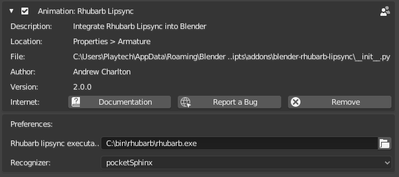
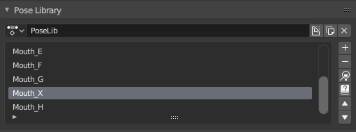

# Blender Rhubarb Lip Sync

[Rhubarb Lip Sync](https://github.com/DanielSWolf/rhubarb-lip-sync) is a command-line tool created by Daniel S. Wolf that automatically creates mouth animation from voice recordings. You can use it for characters in computer games, in animated cartoons, or in any other project that requires animating mouths based on existing recordings.

Blender Rhubarb Lipsync is an addon for [Blender](http://blender.org) that integrates Rhubarb Lip Sync and uses it to generate mouth-shape keyframes from a pose library.

For support using this addon in Blender, please report an issue at https://github.com/scaredyfish/blender-rhubarb-lipsync/issues 

## Example output

http://www.youtube.com/watch?v=azrpByrvw-o

and here's a tutorial video from Studio YogYog

https://youtu.be/xfI94VIX6BA

## Installation

Download a release from https://github.com/scaredyfish/blender-rhubarb-lipsync/releases

_Use version 1.0.5 for Blender 2.79, version 2.0 onwards supports only Blender 2.80 and above._

Do **not** unzip the file.

In Blender, open Blender Preferences ``Edit -> Preferences`` select ``Add-ons`` and choose ``Install...``. In the file dialog, select the ``.ZIP`` file.

## Usage

Blender Rhubarb Lipsync includes the Rhubarb Lip Sync executable, but if you want to use a different executable, you can choose it in user preferences.

You can also set the recognizer here. PocketSphinx is recommended for English language, phonetic may give better results for other languages.

Create a [pose library](https://docs.blender.org/manual/en/dev/animation/armatures/properties/pose_library.html) with the mouth shapes described in the Rhubarb Lip Sync documentation. You can name your poses whatever you like.

Match your poses with the Rhubarb Lip Sync names.
Select your sound file, and dialog file (optional), and the start frame where your sound begins.

In **pose mode**, select the bones you want to keyframe, then click the Rhubarb Lip Sync button and wait for the process to complete. The mouse cursor will change to a progress indicator, and your keyframes will appear when the process is complete.

## Troubleshooting

In the event of problems, you can use the system console (Window->Toggle System Console on Windows, or start Blender from a command line on Mac/Linux) to get more info on progress and error messages. When reporting an issue, please include any errors reported here.
